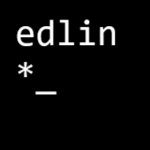

# edlin-snapcraft

## Introduction

These are the files used to describe the [snap package for edlin](https://snapcraft.io/edlin). They are designed for the snapcraft tool.

## Development environment

The simplest starting point is a Ubuntu environment which has `snap`/`snapd` already installed and working. Add the `snapcraft` tool.

- 18.04 $ `sudo apt install snapcraft`
- 22.04 $ `sudo snap install snapcraft --classic`

Your user needs to belong to the `lxd` group. You may need to initaliase `lxd` wth 

```
$ lxd init --auto
```

## Package description

The package description is in [snapcraft.yaml](snap/snapcraft.yaml).

- The source is from [edlin](https://github.com/rhubarb-geek-nz/edlin).
- The base is core22 for the majority of environments or core18 for i386
- The program runs with `strict` sandboxing and uses interfaces to access files
- The `make` plugin is used to perform `make` followed by `make install`.

## Development cycle

Build the snap package with

```
$ snapcraft
```

You can examine the contents with 

```
$ unsquashfs -l edlin_0.9.10_amd64.snap
```

Install with

```
$ sudo snap install edlin_0.9.10_amd64.snap --dangerous
```

This can now be tested by running

```
$ /snap/bin/edlin filename...
```

Once finished testing you can unload with

```
$ sudo snap remove edlin
```

## Publishing

`edlin` is built for multiple architectures. The majority are built using the snapcraft.io build pipeline and managed through the store web interface.

### i386

The `i386` snap package is built using Ubuntu 18.04 running in an i686 VM and then uploaded using

```
$ snapcraft upload --release=stable edlin_0.9.10_i386.snap
```
